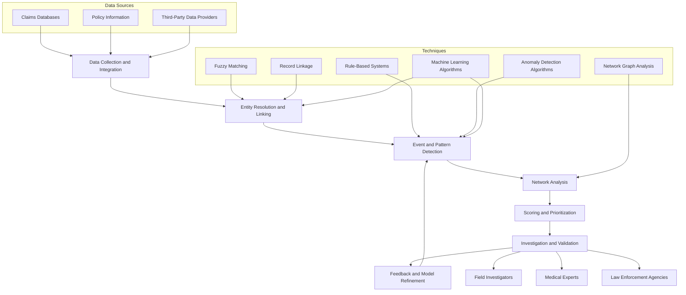

IBM and the client aligned on a compelling business opportunity. Additionally, the teams defined the scope to prove FileNet's capabilities and its installation, configuration, and deployment on AWS EKS. 

The IBM team successfully proved the following: 
- Our product's capabilities in cloud-native environments
- Successful deployment and configuration of our product within the confines of the MVP principle.

Additionally, the IBM team conducted interactive, hands-on keyboard training sessions encompassing a range of critical topics, including:
- Gaining a detailed understanding of the platform, delving into its complex features and capabilities
- Guidance on managing and configuring the product for optimal performance

### Example Mermaid




### Example D2

```d2 sketch pad=50
direction: right

Astro.Markdown -> D2 -> SVG -> Browser.Diagrams -> Astro.Markdown: {style.animated: true}
```